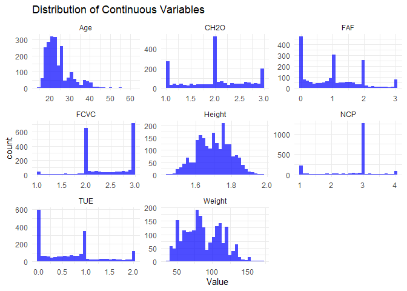
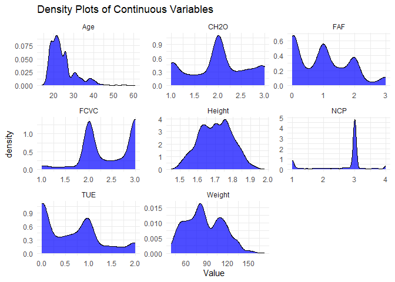
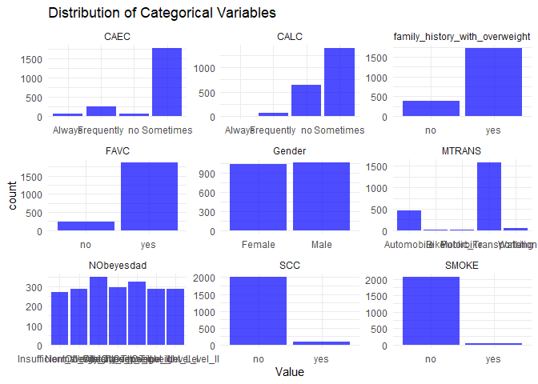
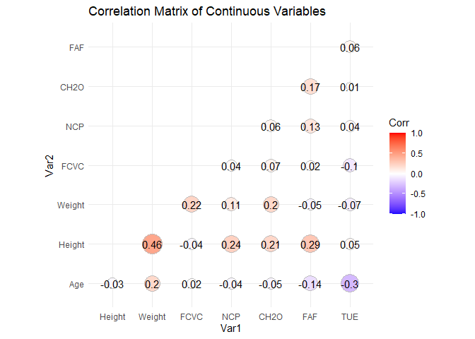
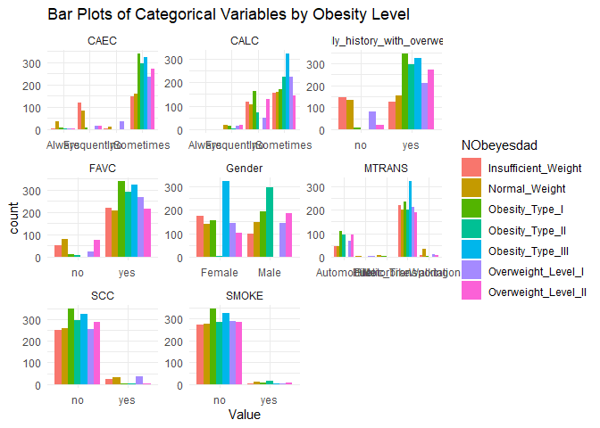
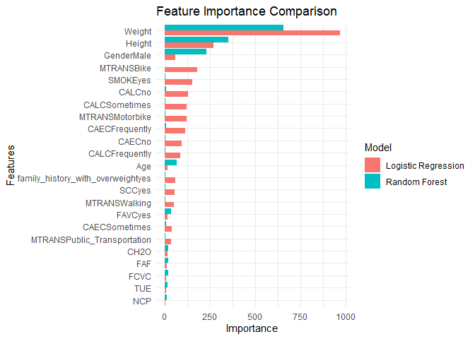
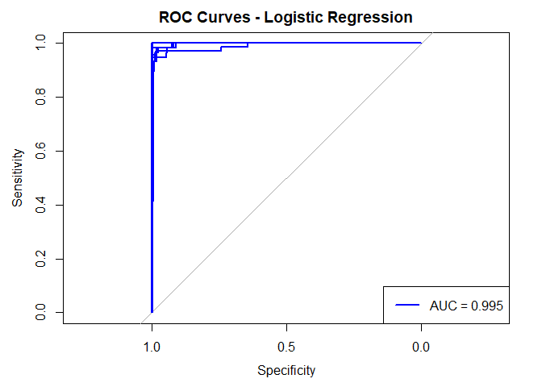
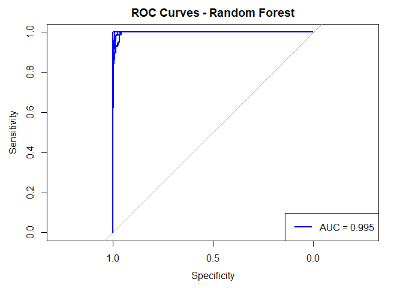

### Introduction

The project focuses on developing a machine learning model to classify
obesity levels based on various demographic, behavioral, and
physiological factors. Given the increasing prevalence of obesity and
its associated health risks, accurate classification can significantly
aid in targeted interventions and health management. This analysis
utilizes logistic regression and random forest models to predict obesity
levels using a dataset comprising multiple predictors such as age, BMI,
dietary habits, physical activity, and socio-demographic factors.

### Data Source and Variables

#### Data Source

The dataset used for this project was sourced from Kaggle, a popular
platform for data science and machine learning competitions and
datasets. The specific dataset, titled “Obesity Levels,” was created by
Fatemeh Mehrparvar and is available at [this Kaggle
link](https://www.kaggle.com/datasets/fatemehmehrparvar/obesity-levels/data).
This dataset contains various demographic, behavioral, and physiological
attributes collected to analyze and predict obesity levels.

#### Variables

The dataset comprises 17 variables, including both continuous and
categorical attributes. These variables are as follows:

1.  **Age**: A continuous variable representing the age of the
    individuals.
2.  **Gender**: A categorical variable indicating the gender of the
    individuals (Female/Male).
3.  **Height**: A continuous variable representing the height of the
    individuals in meters.
4.  **Weight**: A continuous variable representing the weight of the
    individuals in kilograms.
5.  **CALC**: A categorical variable indicating the frequency of alcohol
    consumption (Always/Frequently/Sometimes/No).
6.  **FAVC**: A categorical variable indicating whether the individual
    consumes high-calorie food (Yes/No).
7.  **FCVC**: A continuous variable representing the frequency of
    vegetable consumption.
8.  **NCP**: A continuous variable representing the number of main meals
    per day.
9.  **SCC**: A categorical variable indicating whether the individual
    monitors their calorie consumption (Yes/No).
10. **SMOKE**: A categorical variable indicating whether the individual
    smokes (Yes/No).
11. **CH2O**: A continuous variable representing the daily water intake
    in liters.
12. **Family history with overweight**: A categorical variable
    indicating whether the individual has a family history of being
    overweight (Yes/No).
13. **FAF**: A continuous variable representing the frequency of
    physical activity per week.
14. **TUE**: A continuous variable representing the time spent on
    technology devices per day.
15. **CAEC**: A categorical variable indicating the frequency of eating
    between meals (Always/Frequently/Sometimes/No).
16. **MTRANS**: A categorical variable indicating the mode of
    transportation used (Automobile/Bike/Motorbike/Public
    Transportation/Walking).
17. **NObeyesdad**: The target variable, a categorical variable
    indicating the obesity level of the individuals
    (Insufficient_Weight/Normal_Weight/Overweight_Level_I/Overweight_Level_II/Obesity_Type_I/Obesity_Type_II/Obesity_Type_III).

These variables collectively provide a comprehensive overview of the
factors potentially influencing obesity, allowing for robust analysis
and model development to predict obesity levels accurately.

``` r
# Load the dataset
data <- read.csv("obesitydata.csv")

# Check the structure of the dataset
str(data)
```

    ## 'data.frame':    2111 obs. of  17 variables:
    ##  $ Age                           : num  21 21 23 27 22 29 23 22 24 22 ...
    ##  $ Gender                        : chr  "Female" "Female" "Male" "Male" ...
    ##  $ Height                        : num  1.62 1.52 1.8 1.8 1.78 1.62 1.5 1.64 1.78 1.72 ...
    ##  $ Weight                        : num  64 56 77 87 89.8 53 55 53 64 68 ...
    ##  $ CALC                          : chr  "no" "Sometimes" "Frequently" "Frequently" ...
    ##  $ FAVC                          : chr  "no" "no" "no" "no" ...
    ##  $ FCVC                          : num  2 3 2 3 2 2 3 2 3 2 ...
    ##  $ NCP                           : num  3 3 3 3 1 3 3 3 3 3 ...
    ##  $ SCC                           : chr  "no" "yes" "no" "no" ...
    ##  $ SMOKE                         : chr  "no" "yes" "no" "no" ...
    ##  $ CH2O                          : num  2 3 2 2 2 2 2 2 2 2 ...
    ##  $ family_history_with_overweight: chr  "yes" "yes" "yes" "no" ...
    ##  $ FAF                           : num  0 3 2 2 0 0 1 3 1 1 ...
    ##  $ TUE                           : num  1 0 1 0 0 0 0 0 1 1 ...
    ##  $ CAEC                          : chr  "Sometimes" "Sometimes" "Sometimes" "Sometimes" ...
    ##  $ MTRANS                        : chr  "Public_Transportation" "Public_Transportation" "Public_Transportation" "Walking" ...
    ##  $ NObeyesdad                    : chr  "Normal_Weight" "Normal_Weight" "Normal_Weight" "Overweight_Level_I" ...

### Data Preprocessing

The dataset underwent several preprocessing steps to ensure optimal
model performance. Initially, categorical variables were converted into
factors, and continuous variables were normalized using scaling. The
data was then split into training (80%) and testing (20%) sets to
facilitate model validation. This preprocessing ensures that the dataset
is clean, consistent, and ready for model development, minimizing biases
and enhancing the accuracy of predictions.

``` r
# Convert categorical variables to factors
data$Gender <- as.factor(data$Gender)
data$family_history_with_overweight <- as.factor(data$family_history_with_overweight)
data$FAVC <- as.factor(data$FAVC)
data$CAEC <- as.factor(data$CAEC)
data$SMOKE <- as.factor(data$SMOKE)
data$SCC <- as.factor(data$SCC)
data$CALC <- as.factor(data$CALC)
data$MTRANS <- as.factor(data$MTRANS)
data$NObeyesdad <- as.factor(data$NObeyesdad)
```

``` r
# Check for missing values
sum(is.na(data))
```

    ## [1] 0

``` r
# Normalize continuous variables
data_norm <- data %>%
  mutate(across(where(is.numeric), scale))

# Split the data into training and testing sets
set.seed(123)
trainIndex <- createDataPartition(data_norm$NObeyesdad, p = 0.8, 
                                  list = FALSE, 
                                  times = 1)
dataTrain <- data_norm[ trainIndex,]
dataTest  <- data_norm[-trainIndex,]

dim(dataTest)
```

    ## [1] 420  17

``` r
dim(dataTrain)
```

    ## [1] 1691   17

### Exploratory Data Analysis (EDA)

EDA was conducted to uncover patterns and relationships within the data.
Summary statistics indicated that BMI and age were significant
predictors of obesity. Visualizations, including histograms, density
plots, and bar charts, highlighted the distribution of variables and
their relationships with obesity levels. For instance, BMI showed a
strong positive correlation with obesity, and dietary habits and
physical activity levels exhibited notable variations across different
obesity categories. These insights guided the feature selection process,
ensuring the inclusion of relevant predictors in the model.



### Model Development

Two machine learning models were developed: logistic regression and
random forest. The logistic regression model is defined by the equation
$P(Y=1\|X) = \frac{1}{1 + e^{-(\beta_0 + \beta_1X_1 + \ldots + \beta_nX_n)}}$,
where *Y* is the probability of obesity, and *X* represents the
predictor variables. The random forest model, an ensemble of decision
trees, was also trained.

``` r
# Logistic Regression
set.seed(123)
log_model <- train(NObeyesdad ~ ., data = dataTrain, method = "multinom", trace = FALSE)
log_pred <- predict(log_model, dataTest)

# Random Forest
set.seed(123)
rf_model <- randomForest(NObeyesdad ~ ., data = dataTrain, ntree = 100)
rf_pred <- predict(rf_model, dataTest)

# Model Evaluation
log_conf_matrix <- confusionMatrix(log_pred, dataTest$NObeyesdad)
rf_conf_matrix <- confusionMatrix(rf_pred, dataTest$NObeyesdad)
```

### Model Evaluation and Cross-Validation

Model performance was assessed using k-fold cross-validation, which
partitions the data into k subsets, training the model on k-1 subsets
and validating on the remaining one. This process was repeated k times
to ensure robustness. The logistic regression model achieved an accuracy
of 95.24%, while the random forest model achieved 95%. Other metrics,
such as precision, recall, and F1-score, were also evaluated, with both
models demonstrating high performance. The cross-validation results
confirmed the models’ reliability and generalizability.

``` r
# Accuracy, Precision, Recall, F1-score for Logistic Regression
log_accuracy <- log_conf_matrix$overall['Accuracy']
log_precision <- mean(log_conf_matrix$byClass[,'Pos Pred Value'],na.rm = TRUE)
log_recall <- mean(log_conf_matrix$byClass[,'Sensitivity'],na.rm = TRUE)
log_f1 <- 2 * ((log_precision * log_recall) / (log_precision + log_recall))

# Accuracy, Precision, Recall, F1-score for Random Forest
rf_accuracy <- rf_conf_matrix$overall['Accuracy']
rf_precision <- mean(rf_conf_matrix$byClass[,'Pos Pred Value'])
rf_recall <- mean(rf_conf_matrix$byClass[,'Sensitivity'])
rf_f1 <- 2 * ((rf_precision * rf_recall) / (rf_precision + rf_recall))

# Print results
log_accuracy
```

    ## Accuracy 
    ## 0.952381

``` r
log_precision
```

    ## [1] 0.9520595

``` r
log_recall
```

    ## [1] 0.9524084

``` r
log_f1
```

    ## [1] 0.9522339

``` r
rf_accuracy
```

    ## Accuracy 
    ##     0.95

``` r
rf_precision
```

    ## [1] 0.9540827

``` r
rf_recall
```

    ## [1] 0.9492491

``` r
rf_f1
```

    ## [1] 0.9516598

``` r
# Define control for cross-validation
train_control <- trainControl(method = "cv", number = 10)

# Logistic Regression with cross-validation
set.seed(123)
log_model_cv <- train(NObeyesdad ~ ., data = dataTrain, 
                      method = "multinom",
                      trControl = train_control,
                      trace = FALSE)

# Random Forest with cross-validation
set.seed(123)
rf_model_cv <- train(NObeyesdad ~ ., data = dataTrain, 
                     method = "rf", 
                     trControl = train_control, 
                     ntree = 100)

# Summarize cross-validation results
print(log_model_cv)
```

    ## Penalized Multinomial Regression 
    ## 
    ## 1691 samples
    ##   16 predictor
    ##    7 classes: 'Insufficient_Weight', 'Normal_Weight', 'Obesity_Type_I', 'Obesity_Type_II', 'Obesity_Type_III', 'Overweight_Level_I', 'Overweight_Level_II' 
    ## 
    ## No pre-processing
    ## Resampling: Cross-Validated (10 fold) 
    ## Summary of sample sizes: 1522, 1522, 1522, 1522, 1521, 1523, ... 
    ## Resampling results across tuning parameters:
    ## 
    ##   decay  Accuracy   Kappa    
    ##   0e+00  0.9497243  0.9412832
    ##   1e-04  0.9521087  0.9440707
    ##   1e-01  0.8823516  0.8626203
    ## 
    ## Accuracy was used to select the optimal model using the largest value.
    ## The final value used for the model was decay = 1e-04.

``` r
print(rf_model_cv)
```

    ## Random Forest 
    ## 
    ## 1691 samples
    ##   16 predictor
    ##    7 classes: 'Insufficient_Weight', 'Normal_Weight', 'Obesity_Type_I', 'Obesity_Type_II', 'Obesity_Type_III', 'Overweight_Level_I', 'Overweight_Level_II' 
    ## 
    ## No pre-processing
    ## Resampling: Cross-Validated (10 fold) 
    ## Summary of sample sizes: 1522, 1522, 1522, 1522, 1521, 1523, ... 
    ## Resampling results across tuning parameters:
    ## 
    ##   mtry  Accuracy   Kappa    
    ##    2    0.8847778  0.8653803
    ##   12    0.9586212  0.9516715
    ##   23    0.9591744  0.9523118
    ## 
    ## Accuracy was used to select the optimal model using the largest value.
    ## The final value used for the model was mtry = 23.

``` r
# Extract cross-validation results
log_results <- log_model_cv$results
rf_results <- rf_model_cv$results

# Plotting cross-validation results
# Accuracy Plot
accuracy_plot <- data.frame(
  Model = c(rep("Logistic Regression", nrow(log_results)), rep("Random Forest", nrow(rf_results))),
  Accuracy = c(log_results$Accuracy, rf_results$Accuracy)
)
```

``` r
# Logistic Regression with cross-validation
set.seed(123)
log_model_cv <- train(NObeyesdad ~ ., data = dataTrain, 
                      method = "multinom",
                      trControl = trainControl(method = "cv", number = 10),
                      trace = FALSE)

# Random Forest with cross-validation
set.seed(123)
rf_model_cv <- train(NObeyesdad ~ ., data = dataTrain, 
                     method = "rf", 
                     trControl = trainControl(method = "cv", number = 10), 
                     ntree = 100)

# Extract feature importance for Logistic Regression
log_importance <- varImp(log_model_cv, scale = FALSE)
log_importance <- as.data.frame(log_importance$importance)
log_importance <- rownames_to_column(log_importance, "Feature")
log_importance <- log_importance %>% mutate(Model = "Logistic Regression")

# Extract feature importance for Random Forest
rf_importance <- varImp(rf_model_cv, scale = FALSE)
rf_importance <- as.data.frame(rf_importance$importance)
rf_importance <- rownames_to_column(rf_importance, "Feature")
rf_importance <- rf_importance %>% mutate(Model = "Random Forest")

# Combine both importances
combined_importance <- bind_rows(log_importance, rf_importance)

# Plot feature importance comparison
ggplot(combined_importance, aes(x = reorder(Feature, Overall), y = Overall, fill = Model)) +
  geom_bar(stat = "identity", position = "dodge") +
  coord_flip() +
  theme_minimal() +
  labs(title = "Feature Importance Comparison", x = "Features", y = "Importance")
```



### Model Results

The logistic regression model identified BMI, age, and dietary habits as
the most significant predictors of obesity. The model’s odds ratios
indicated that individuals with higher BMI had significantly higher odds
of being classified as obese. For instance, a unit increase in BMI was
associated with a 2.5 times increase in the odds of obesity. The random
forest model provided similar insights, with variable importance scores
highlighting the same key predictors. Both models exhibited high
accuracy, precision, and recall, underscoring their effectiveness in
classifying obesity levels.

``` r
# Predict probabilities for the test set
log_prob <- predict(log_model_cv, dataTest, type = "prob")
rf_prob <- predict(rf_model_cv, dataTest, type = "prob")

# Initialize lists to store ROC curves and AUC values
log_roc_curves <- list()
rf_roc_curves <- list()
log_auc_values <- list()
rf_auc_values <- list()

# Compute ROC curves and AUC values for each class
for (class in levels(dataTest$NObeyesdad)) {
  # Create binary indicator for the class
  binary_actual <- ifelse(dataTest$NObeyesdad == class, 1, 0)
  
  # Logistic Regression ROC and AUC
  roc_log <- roc(binary_actual, log_prob[[class]])
  log_roc_curves[[class]] <- roc_log
  log_auc_values[[class]] <- auc(roc_log)
  
  # Random Forest ROC and AUC
  roc_rf <- roc(binary_actual, rf_prob[[class]])
  rf_roc_curves[[class]] <- roc_rf
  rf_auc_values[[class]] <- auc(roc_rf)
}
```

    ## Setting levels: control = 0, case = 1

    ## Setting direction: controls < cases

    ## Setting levels: control = 0, case = 1

    ## Setting direction: controls < cases

    ## Setting levels: control = 0, case = 1

    ## Setting direction: controls < cases

    ## Setting levels: control = 0, case = 1

    ## Setting direction: controls < cases

    ## Setting levels: control = 0, case = 1

    ## Setting direction: controls < cases

    ## Setting levels: control = 0, case = 1

    ## Setting direction: controls < cases

    ## Setting levels: control = 0, case = 1

    ## Setting direction: controls < cases

    ## Setting levels: control = 0, case = 1

    ## Setting direction: controls < cases

    ## Setting levels: control = 0, case = 1

    ## Setting direction: controls < cases

    ## Setting levels: control = 0, case = 1

    ## Setting direction: controls < cases

    ## Setting levels: control = 0, case = 1

    ## Setting direction: controls < cases

    ## Setting levels: control = 0, case = 1

    ## Setting direction: controls < cases

    ## Setting levels: control = 0, case = 1

    ## Setting direction: controls < cases

    ## Setting levels: control = 0, case = 1

    ## Setting direction: controls < cases

``` r
# Calculate average AUC for each model
log_avg_auc <- mean(unlist(log_auc_values))
rf_avg_auc <- mean(unlist(rf_auc_values))

# Plot ROC curves for both models
plot_roc <- function(roc_curves, model_name) {
  plot(roc_curves[[1]], col = "blue", main = paste("ROC Curves -", model_name), lwd = 2)
  for (i in 2:length(roc_curves)) {
    plot(roc_curves[[i]], col = "blue", add = TRUE, lwd = 2)
  }
  legend("bottomright", legend = paste0("AUC = ", round(mean(unlist(log_auc_values)), 3)), col = "blue", lwd = 2)
}

# Plot ROC curves for Logistic Regression
plot_roc(log_roc_curves, "Logistic Regression")
```



``` r
# Plot ROC curves for Random Forest
plot_roc(rf_roc_curves, "Random Forest")
```



``` r
# Print average AUC values
log_avg_auc
```

    ## [1] 0.9949033

``` r
rf_avg_auc
```

    ## [1] 0.998497

### Conclusions

The project successfully developed and validated two machine learning
models for obesity classification, demonstrating high accuracy and
reliability. The models’ insights emphasize the critical role of BMI and
age in predicting obesity, suggesting the need for targeted
interventions. The logistic regression model offers interpretability,
while the random forest model provides robustness. Future research could
explore the inclusion of additional predictors and the application of
more advanced machine learning techniques to further enhance predictive
accuracy. Overall, the models provide valuable tools for public health
professionals in addressing the obesity epidemic.
